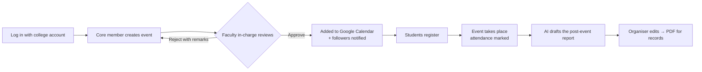

<h2 align="center">🎓 CommUnity — for Committees and Clubs</h2>

<p align="center">
  A centralized portal that runs the complete event lifecycle of college clubs and committees —
  from proposal and faculty approval to calendar scheduling, registrations and an AI-drafted post-event report.
</p>

<p align="center">
  <a href="https://forthebadge.com"></a>
  <a href="https://forthebadge.com"></a>
</p>

<h3 align="center">
  🔹 <a href="https://github.com/kushal-s0/CommUnity/issues">Report Bug</a> &nbsp; 🔹
  <a href="https://github.com/kushal-s0/CommUnity/issues">Request Feature</a> &nbsp; 🔹
  <a href="https://drive.google.com/file/d/1gnXLSHoTurimSiFqCFEbPClosUyVyl-U/view?usp=sharing">Watch Demo</a>
</h3>

---

## 🌟 Overview

**CommUnity** reduces manual work in running college clubs and committees by bringing event creation,
approval, scheduling and post-event documentation into one system.



## 🏛️ Features

### Role-based access
| Role | What they can do |
|---|---|
| **Faculty** | Approve/reject clubs, committees, events and deletion requests (with remarks) · appoint core members · reserve dates (if permitted) · read every report of their teams · dashboard with pending queue, upcoming events and a monthly activity chart |
| **Core member** | Create one club/committee · schedule, edit, resubmit and cancel events · post announcements · add members / core members · mark attendance · generate and edit post-event reports |
| **Member / student** | Follow clubs, register for events, get notifications, add events to their calendar |

Every view is protected by a role decorator (`Login/permissions.py`); only `@somaiya.edu` accounts can sign up (e-mail or Google).

### Event management & approval workflow
- Create events with venue, duration, poster and an optional seat limit.
- **Smart scheduling:** a live availability check while typing flags venue clashes, faculty-reserved dates and competing pending requests; conflicts are re-checked at approval time so two requests for one slot can never both be approved.
- Faculty approve or reject with remarks; organisers can edit and resubmit rejected events.
- Every step is recorded in an **activity timeline** (submitted → approved → synced → report).
- In-app **notifications** plus e-mail for approvals, rejections, cancellations and new events from followed clubs.

### Google Calendar integration
- Approved events are pushed to the shared college calendar (service account) and removed if cancelled.
- Every attendee gets an **“Add to Google Calendar”** link and a downloadable `.ics` file.
- A subscribable **iCal feed** (`/events/calendar.ics`) keeps anyone's phone calendar up to date.

### AI-powered post-event reports
- After an event, organisers answer a short form (speakers, agenda, outcomes, feedback…).
- **Claude** (Anthropic) drafts a formal, sectioned report using only the facts provided; the organiser reviews and edits it. this will be changed to the normal free api work in progess stay there 
- A branded **PDF** is generated for the college records. Faculty see every submitted report and which ones are still due.
- Works without an API key too: an offline template builds a structured draft from the same answers.

### Also included
Registrations with seat limits · attendance marking and CSV export · club/committee pages with gallery,
team and past-event reports · notice board · follow/unfollow · profile pages · responsive design ·
demo-data command · automated test suite.

## 🚀 Tech stack
**Python · Django 5 · MySQL (or SQLite for development) · Generative AI (Claude API) · Google Calendar API ·
django-allauth (Google OAuth) · ReportLab · FullCalendar**

## 🛠 Installation

```bash
git clone https://github.com/kushal-s0/CommUnity.git
cd CommUnity/CommUnity

python -m venv venv
venv\Scripts\activate            # macOS/Linux: source venv/bin/activate
pip install -r requirements.txt

copy .env.example .env           # macOS/Linux: cp .env.example .env
python manage.py migrate
python manage.py seed_demo       # optional: sample clubs, events and a finished report
python manage.py runserver
```

Visit http://127.0.0.1:8000/. After `seed_demo`, log in with any demo account (password `CommUnity@123`):
`kavita.sharma@somaiya.edu` (faculty), `aarav.mehta@somaiya.edu` (core member), `ananya.rao@somaiya.edu` (student).

Every setting lives in `.env` — see [`.env.example`](CommUnity/.env.example). Nothing is required for local development.

### MySQL
```sql
CREATE DATABASE community CHARACTER SET utf8mb4 COLLATE utf8mb4_unicode_ci;
```
```ini
DB_ENGINE=mysql
DB_NAME=community
DB_USER=root
DB_PASSWORD=your-password
```
Then run `python manage.py migrate`. To move existing SQLite data across:
`python manage.py dumpdata --natural-foreign --exclude contenttypes --exclude auth.permission > data.json`
with the old settings, then `python manage.py loaddata data.json` with `DB_ENGINE=mysql`.

### Generative AI (Claude)
Set `ANTHROPIC_API_KEY` in `.env`. Reports use `claude-opus-5` by default (`AI_MODEL` to change).
`AI_PROVIDER=huggingface` with `HUGGINGFACE_API_KEY` is also supported; without any key the offline template is used.

### Google Calendar & Google sign-in
1. Create a Google Cloud service account with the Calendar API enabled and download its JSON key into this folder.
2. Share the college calendar with the service account e-mail (“Make changes to events”).
3. Set `GOOGLE_SERVICE_ACCOUNT_FILE` and `GOOGLE_CALENDAR_ID`.
4. For “Continue with Google”, set `GOOGLE_CLIENT_ID` / `GOOGLE_CLIENT_SECRET` (OAuth client, redirect URI `http://127.0.0.1:8000/accounts/google/login/callback/`).

### Faculty accounts
Sign up, then in `/admin/` set the user's profile role to **Faculty** (and tick *Can lock dates* on their Faculty record to allow reserving dates).

## ✅ Tests
```bash
python manage.py test
```
Covers every page for every role, permission guards, the full approval workflow, scheduling conflicts,
reserved dates, registrations, attendance, AI report generation (with a mocked Claude client and the offline fallback),
PDF output, calendar feeds and domain-restricted sign-up.

## 📁 Project structure
```
CommUnity/
├── CommUnity/        settings (env-driven), URLs
├── Login/            users, profiles, roles & permissions, notifications, dashboards, auth adapters
├── committees/       clubs & committees, gallery, follow, ownership
├── events/           events, approval workflow, registrations, calendar, AI reports, PDF
├── faculty/          faculty dashboard, approvals, reserved dates, reports, core-member appointment
├── members/          announcements, notice board, team management
├── templates/        site-wide templates (one shared layout)
└── static/           app.css design system, app.js
```

<h2 align="center">👨‍💻 Developed By</h2>
<p align="center">
  <a href="https://github.com/Sagar-Shetty0804">Sagar</a> •
  <a href="https://github.com/kushal-s0">Kushal</a> •
  <a href="https://github.com/pTIWARI-20">Pragati</a> •
  <a href="https://github.com/aditya-s27">Aditya</a>
</p>
<p align="center">⭐ Give this project a star if you like it!</p>

Thanks You
