<p align="center">
  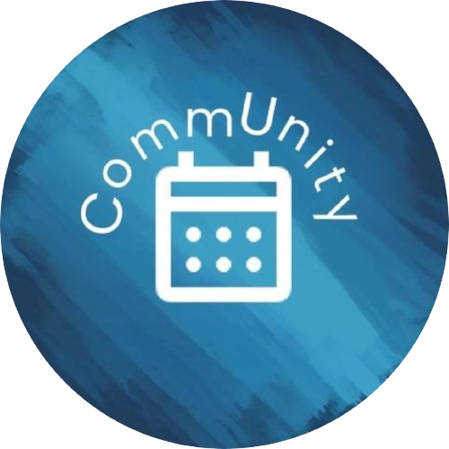
</p>

<h1 align="center">CommUnity</h1>

<p align="center">
  <b>One portal for every college club and committee.</b><br/>
  Propose an event → faculty approval → calendar → registrations → AI-drafted post-event report.
</p>

<p align="center">
  
  
  
  
  
</p>

<p align="center">
  <a href="https://drive.google.com/file/d/1gnXLSHoTurimSiFqCFEbPClosUyVyl-U/view?usp=sharing">▶️ Watch Demo</a> ·
  <a href="https://github.com/kushal-s0/CommUnity/issues">🐞 Report Bug</a> ·
  <a href="https://github.com/kushal-s0/CommUnity/issues">✨ Request Feature</a>
</p>

<p align="center">
  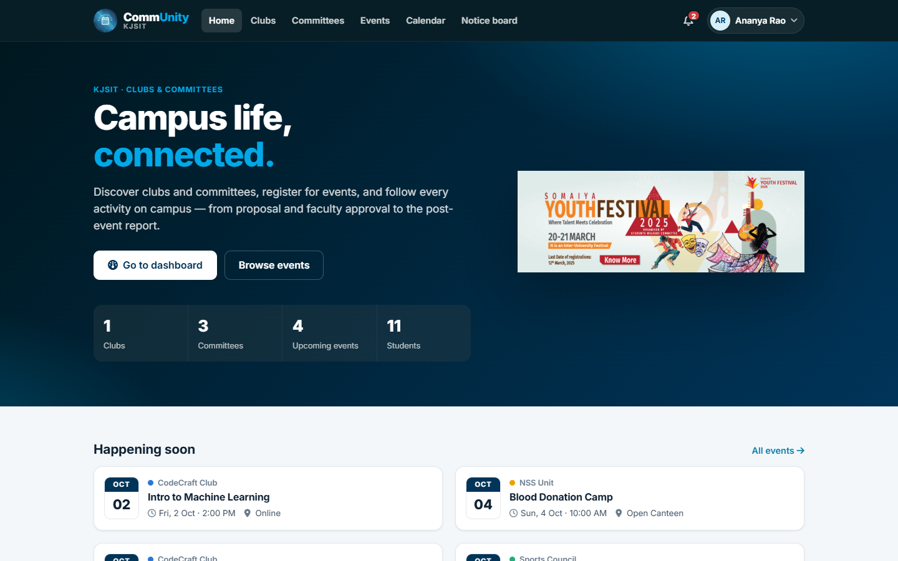
</p>

---

## 📑 Contents
- [Overview](#-overview)
- [Screenshots](#-screenshots)
- [Features](#-features)
- [Tech stack](#-tech-stack)
- [Getting started](#-getting-started)
- [Configuration](#%EF%B8%8F-configuration)
- [Tests](#-tests)
- [Project structure](#-project-structure)
- [Team](#-developed-by)

## 🌟 Overview

Running a college club usually means spreadsheets, WhatsApp groups, e-mail chains for approvals and a report written from scratch after every event. **CommUnity** puts the whole event lifecycle in one place:

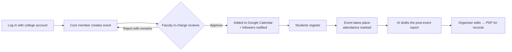
```mermaid
flowchart LR
    A[Log in with college account] --> B[Core member creates event]
    B --> C{Faculty in-charge reviews}
    C -- Reject with remarks --> B
    C -- Approve --> D[Added to Google Calendar<br/>+ followers notified]
    D --> E[Students register]
    E --> F[Event takes place<br/>attendance marked]
    F --> G[AI drafts the post-event report]
    G --> H[Organiser edits → PDF for records]
```

## 📸 Screenshots

<table>
  <tr>
    <td width="50%">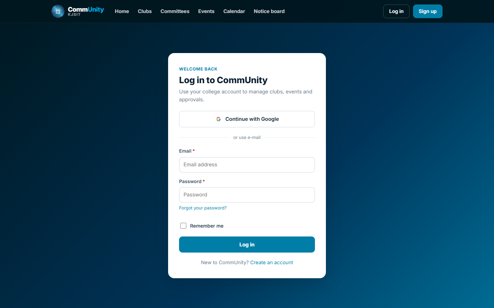<p align="center"><b>Login</b> — college e-mail or Google</p></td>
    <td width="50%">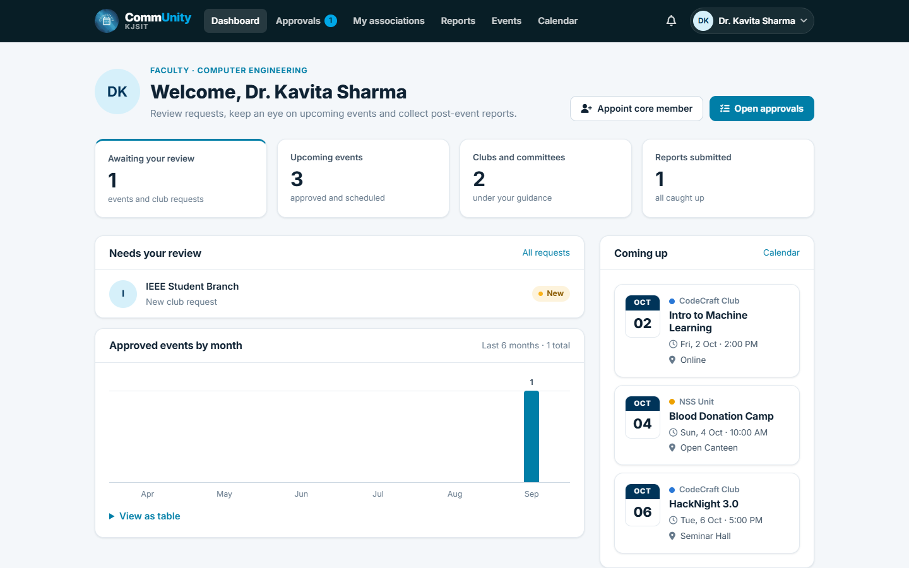<p align="center"><b>Faculty dashboard</b> — pending queue, upcoming events, monthly chart</p></td>
  </tr>
  <tr>
    <td>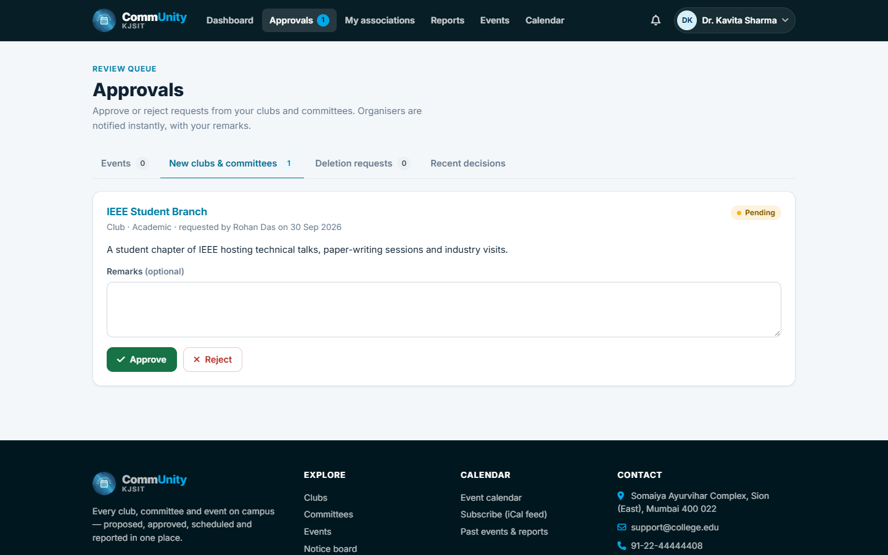<p align="center"><b>Approvals</b> — approve or reject with remarks</p></td>
    <td>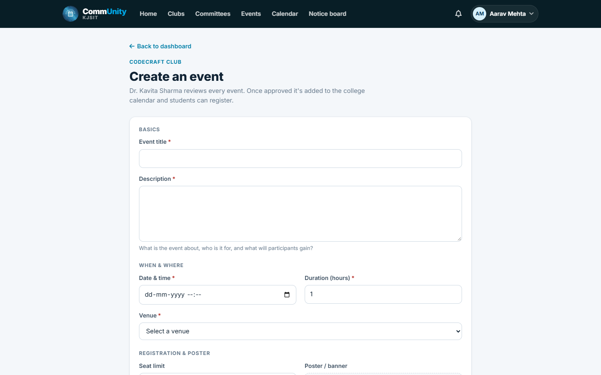<p align="center"><b>Create event</b> — live venue/date clash check</p></td>
  </tr>
  <tr>
    <td>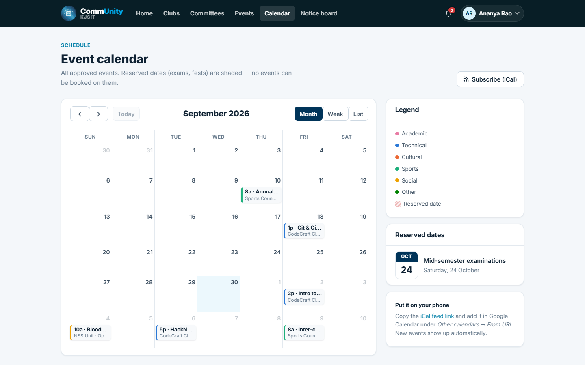<p align="center"><b>Event calendar</b> — reserved dates + iCal subscription</p></td>
    <td>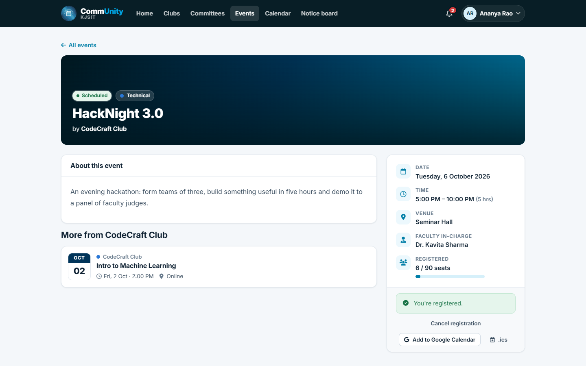<p align="center"><b>Event page</b> — seats, registration, add to Google Calendar</p></td>
  </tr>
  <tr>
    <td>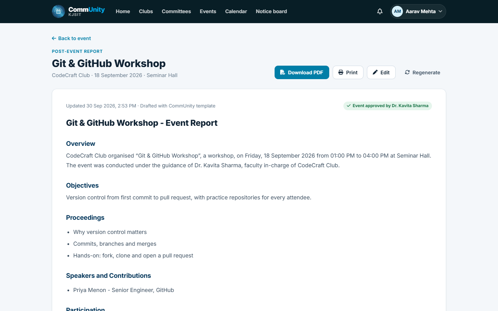<p align="center"><b>AI post-event report</b> — edit, print or download PDF</p></td>
    <td>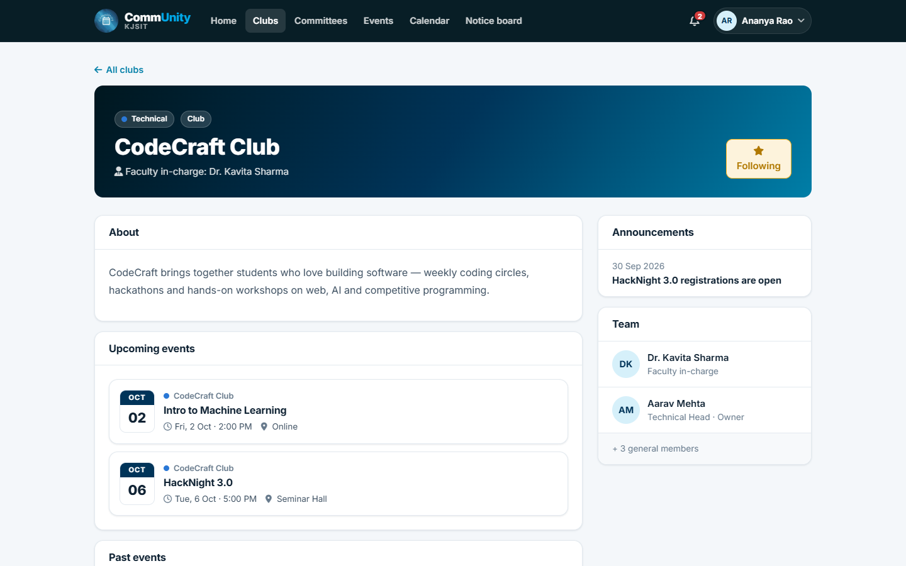<p align="center"><b>Club page</b> — about, events, announcements, team</p></td>
  </tr>
</table>

<p align="center">
  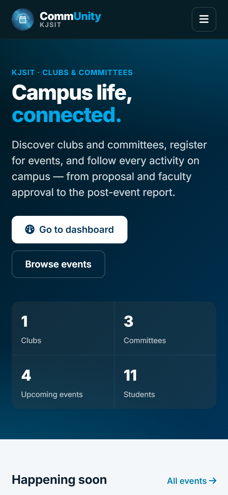<br/>
  <b>Fully responsive</b> — works on phones too
</p>

## 🏛️ Features

### 👥 Role-based access
| Role | What they can do |
|---|---|
| **Faculty** | Approve/reject clubs, committees, events and deletion requests (with remarks) · appoint core members · reserve dates (if permitted) · read every report of their teams · dashboard with pending queue, upcoming events and a monthly activity chart |
| **Core member** | Create one club/committee · schedule, edit, resubmit and cancel events · post announcements · add members / core members · mark attendance · generate and edit post-event reports |
| **Member / student** | Follow clubs, register for events, get notifications, add events to their calendar |

Every view is protected by a role decorator ([`Login/permissions.py`](CommUnity/Login/permissions.py)), and only `@somaiya.edu` accounts can sign up (e-mail or Google).

### 📅 Event management & approval workflow
- Create events with venue, duration, poster and an optional seat limit.
- **Smart scheduling:** a live availability check while typing flags venue clashes, faculty-reserved dates and competing pending requests. Conflicts are re-checked at approval time, so two requests for the same slot can never both be approved.
- Faculty approve or reject with remarks; organisers can edit and resubmit rejected events.
- Every step is recorded in an **activity timeline** (submitted → approved → synced → report).
- In-app **notifications** plus e-mail for approvals, rejections, cancellations and new events from followed clubs.

### 🗓️ Google Calendar integration
- Approved events are pushed to the shared college calendar (service account) and removed if cancelled.
- Every attendee gets an **"Add to Google Calendar"** link and a downloadable `.ics` file.
- A subscribable **iCal feed** (`/events/calendar.ics`) keeps anyone's phone calendar up to date.

### 🤖 AI-powered post-event reports
- After an event, organisers answer a short form (speakers, agenda, outcomes, feedback…).
- **Claude** (Anthropic) drafts a formal, sectioned report using only the facts provided; the organiser reviews and edits it.
- A branded **PDF** is generated for the college records. Faculty see every submitted report and which ones are still due.
- Works without an API key too: an offline template builds a structured draft from the same answers, and a free Hugging Face model can be used instead of Claude.

> 🚧 **Work in progress:** we're moving the default report generator to a free API.

### ➕ Also included
Registrations with seat limits · attendance marking and CSV export · club/committee pages with gallery, team and past-event reports · notice board · follow/unfollow · profile pages · responsive design · demo-data command · automated test suite.

## 🚀 Tech stack

| Layer | Tech |
|---|---|
| Backend | Python, Django 5, django-allauth (Google OAuth) |
| Database | MySQL (production) / SQLite (development) |
| Integrations | Google Calendar API, Claude API / Hugging Face |
| Documents | ReportLab (PDF), Markdown |
| Frontend | Django templates, custom CSS design system, FullCalendar |

## 🛠 Getting started

```bash
git clone https://github.com/kushal-s0/CommUnity.git
cd CommUnity/CommUnity

python -m venv venv
venv\Scripts\activate            # macOS/Linux: source venv/bin/activate
pip install -r requirements.txt

copy .env.example .env           # macOS/Linux: cp .env.example .env
python manage.py migrate
python manage.py seed_demo       # optional: sample clubs, events and a finished report
python manage.py runserver
```

Open **http://127.0.0.1:8000/**. After `seed_demo`, log in with any demo account (password `CommUnity@123`):

| Role | E-mail |
|---|---|
| Faculty | `kavita.sharma@somaiya.edu` |
| Core member | `aarav.mehta@somaiya.edu` |
| Student | `ananya.rao@somaiya.edu` |

## ⚙️ Configuration

Every setting lives in `.env` — see [`.env.example`](CommUnity/.env.example). **Nothing is required for local development.**

<details>
<summary><b>MySQL</b></summary>

```sql
CREATE DATABASE community CHARACTER SET utf8mb4 COLLATE utf8mb4_unicode_ci;
```
```ini
DB_ENGINE=mysql
DB_NAME=community
DB_USER=root
DB_PASSWORD=your-password
```
Then run `python manage.py migrate`. To move existing SQLite data across, run
`python manage.py dumpdata --natural-foreign --exclude contenttypes --exclude auth.permission > data.json`
with the old settings, then `python manage.py loaddata data.json` with `DB_ENGINE=mysql`.
</details>

<details>
<summary><b>Generative AI (reports)</b></summary>

- `AI_PROVIDER=auto | anthropic | huggingface | template`
- **Claude:** set `ANTHROPIC_API_KEY` (model via `AI_MODEL`, default `claude-opus-5`).
- **Hugging Face:** set `AI_PROVIDER=huggingface` and `HUGGINGFACE_API_KEY`.
- **No key:** the offline template is used automatically.
</details>

<details>
<summary><b>Google Calendar & Google sign-in</b></summary>

1. Create a Google Cloud service account with the Calendar API enabled and download its JSON key into `CommUnity/`.
2. Share the college calendar with the service-account e-mail ("Make changes to events").
3. Set `GOOGLE_SERVICE_ACCOUNT_FILE` and `GOOGLE_CALENDAR_ID`.
4. For "Continue with Google", set `GOOGLE_CLIENT_ID` / `GOOGLE_CLIENT_SECRET` (OAuth client, redirect URI `http://127.0.0.1:8000/accounts/google/login/callback/`).
</details>

<details>
<summary><b>Faculty accounts</b></summary>

Sign up, then in `/admin/` set the user's profile role to **Faculty** (and tick *Can lock dates* on their Faculty record to allow reserving dates).
</details>

## ✅ Tests

```bash
python manage.py test
```

Covers every page for every role, permission guards, the full approval workflow, scheduling conflicts, reserved dates, registrations, attendance, AI report generation (with a mocked Claude client and the offline fallback), PDF output, calendar feeds and domain-restricted sign-up.

## 📁 Project structure

```
CommUnity/
├── CommUnity/        settings (env-driven), URLs
├── Login/            users, profiles, roles & permissions, notifications, dashboards, auth adapters
├── committees/       clubs & committees, gallery, follow, ownership
├── events/           events, approval workflow, registrations, calendar, AI reports, PDF
├── faculty/          faculty dashboard, approvals, reserved dates, reports, core-member appointment
├── members/          announcements, notice board, team management
├── templates/        site-wide templates (one shared layout)
└── static/           app.css design system, app.js
```

## 👨‍💻 Developed by

<p align="center">
  <a href="https://github.com/Sagar-Shetty0804"><b>Sagar</b></a> •
  <a href="https://github.com/kushal-s0"><b>Kushal</b></a> •
  <a href="https://github.com/pTIWARI-20"><b>Pragati</b></a> •
  <a href="https://github.com/aditya-s27"><b>Aditya</b></a>
</p>

<p align="center">⭐ If you like this project, give it a star!</p>
